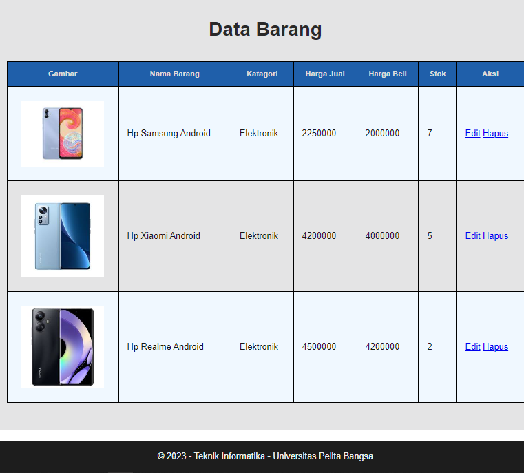
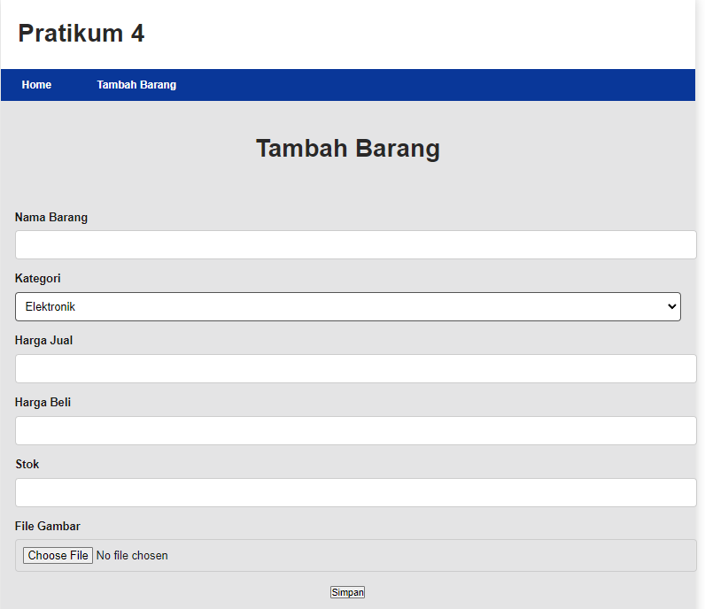
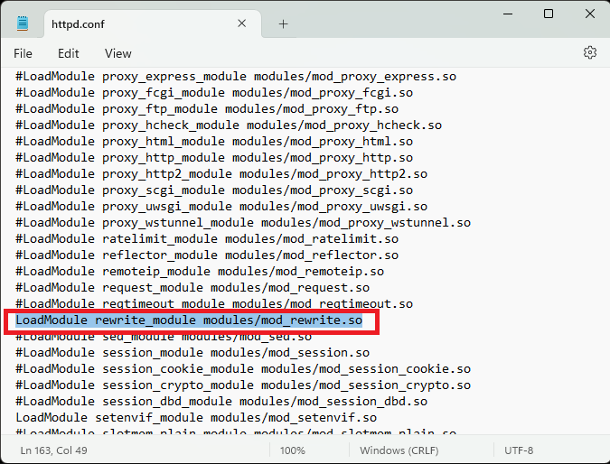
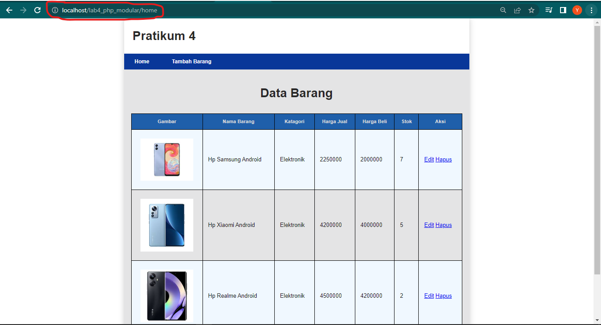
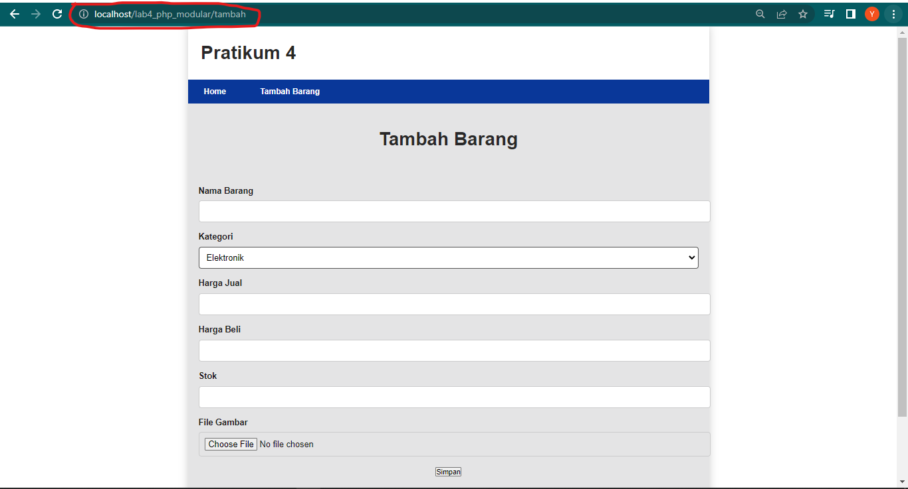

# Lab4Web
# Praktikum 4: PHP Modular

## Implementasikan konsep modularisasi pada kode program praktikum 3 tentang database, sehingga setiap halamannya memiliki template tampilan yang sama.

### Instruksi Praktikum
1. Persiapkan text editor misalnya VSCode.
2. Buat folder baru dengan nama lab4_php_modular pada docroot webserver (htdocs)
3. Ikuti langkah-langkah praktikum yang akan dijelaskan berikutnya.


## Langkah Praktikum

1. Buat file baru dengan nama ``header.php`` lalu simpan ke dalam folder ``lab4_php_modular``.

```php
    <?php
    include("koneksi.php");

    // query untuk menampilkan data
    $sql = 'SELECT * FROM data_barang';
    $result = mysqli_query($conn, $sql);
    ?>

    <!DOCTYPE html>
    <html lang="en">
    <head>
        <meta charset="UTF-8">
        <title>Latihan Modularisasi</title>
        <link href="style.css" rel="stylesheet" type="text/css"/>
    </head>
    <body>
        <div id="container">
        <header>
            <h1>Pratikum 4</h1>
        </header>
        <nav>
            <a href="home.php">Home</a>
            <a href="tambah.php">Tambah Barang</a>
        </nav>
```

2. Buat file baru dengan nama ``footer.php``, kemudian simpan ke dalam folder ``lab4_php_modular``.

```
    <footer>
        <p>&copy; 2023 - Teknik Informatika - Universitas Pelita Bangsa</p>
    </footer>
</div>
</body>
</html>
```

3. Buat file baru dengan nama ``home.php``, kemudian simpan ke dalam folder ``lab4_php_modular``.

```php
<?php require('header.php'); ?>

<div class="content">
<h2>Data Barang</h2>
    <div class="main">
        <table>
        <tr>
            <th>Gambar</th>
            <th>Nama Barang</th>
            <th>Katagori</th>
            <th>Harga Jual</th>
            <th>Harga Beli</th>
            <th>Stok</th>
            <th>Aksi</th>
        </tr>
        <?php if($result): ?>
        <?php while($row = mysqli_fetch_array($result)): ?>
        <tr>
            <td>" alt="<?=$row['nama'];?>"></td>
            <td><?= $row['nama'];?></td>
            <td><?= $row['kategori'];?></td>
            <td><?= $row['harga_jual'];?></td>
            <td><?= $row['harga_beli'];?></td>
            <td><?= $row['stok'];?></td>
            <td>
                <a href="ubah.php?id=<?= $row['id_barang'];?>">Ubah</a>
                <a href="hapus.php?id=<?= $row['id_barang'];?>">Hapus</a> 
            </td>
        </tr>
        <?php endwhile; else: ?>
        <tr>
            <td colspan="7">Belum ada data</td>
        </tr>
        <?php endif; ?>
        </table>
    </div>
</div>

<?php require('footer.php'); ?>
```

4. Buat file baru dengan nama ``tambah.php``, kemudian simpan ke dalam folder ``lab4_php_modular``.

```php
<?php
error_reporting(E_ALL);
include_once 'koneksi.php';

if (isset($_POST['submit']))
{
    $nama = $_POST['nama'];
    $kategori = $_POST['kategori'];
    $harga_jual = $_POST['harga_jual'];
    $harga_beli = $_POST['harga_beli'];
    $stok = $_POST['stok'];
    $file_gambar = $_FILES['file_gambar'];
    $gambar = null;

    if ($file_gambar['error'] == 0)
    {
        $filename = str_replace(' ', '_',$file_gambar['name']);
        $destination = dirname(__FILE__) .'/gambar/' . $filename;
        if(move_uploaded_file($file_gambar['tmp_name'], $destination))
        {
            $gambar = 'gambar/' . $filename;;
        }
    }
    $sql = 'INSERT INTO data_barang (nama, kategori, harga_jual, harga_beli, stok, gambar) ';
    $sql .= "VALUE ('{$nama}', '{$kategori}','{$harga_jual}','{$harga_beli}', '{$stok}', '{$gambar}')";
    $result = mysqli_query($conn, $sql);
    header('location: home.php');
}
?>

<?php require('header.php'); ?>

<div class="content">
        <h2>Tambah Barang</h2>
        <br></br>
        <div class="main">
            <form method="post" action="tambah.php" enctype="multipart/form-data">
                <div class="input">
                    <label>Nama Barang</label>
                    <input type="text" name="nama" />
                </div>
                <div class="input">
                    <label>Kategori</label>
                    <select name="kategori">
                        <option value="Komputer">Komputer</option>
                        <option value="Elektronik">Elektronik</option>
                        <option value="Hand Phone">Hand Phone</option>
                    </select>
                </div>
                <div class="input">
                    <label>Harga Jual</label>
                    <input type="text" name="harga_jual" />
                </div>
                <div class="input">
                    <label>Harga Beli</label>
                    <input type="text" name="harga_beli" />
                </div>
                <div class="input">
                    <label>Stok</label>
                    <input type="text" name="stok" />
                </div>
                <div class="input">
                    <label>File Gambar</label>
                    <input type="file" name="file_gambar" />
                </div>
                <div class="submit">
                    <input type="submit" name="submit" value="Simpan" />
                </div>
                <br></br>
            </form>
        </div>
    </div>

<?php require('footer.php'); ?>
```

5. Buat file baru dengan nama ``ubah.php``, kemudian simpan ke dalam folder ``lab4_php_modular``.

```php
<?php
error_reporting(E_ALL);
include_once 'koneksi.php';

if (isset($_POST['submit'])) 
{
    $id = $_POST['id'];
    $nama = $_POST['nama'];
    $kategori = $_POST['kategori'];
    $harga_jual = $_POST['harga_jual'];
    $harga_beli = $_POST['harga_beli'];
    $stok = $_POST['stok'];
    $file_gambar = $_FILES['file_gambar'];
    $gambar = null;

    if ($file_gambar['error'] == 0) 
    {
        $filename = str_replace(' ', '_', $file_gambar['name']);
        $destination = dirname(__FILE__) . '/gambar/' . $filename;
        if (move_uploaded_file($file_gambar['tmp_name'], $destination)) {
            $gambar = 'gambar/' . $filename;;
        }
    }
    $sql = 'UPDATE data_barang SET ';
    $sql .= "nama = '{$nama}', kategori = '{$kategori}', ";
    $sql .= "harga_jual = '{$harga_jual}', harga_beli = '{$harga_beli}', stok = '{$stok}' ";
    if (!empty($gambar))
    $sql .= ", gambar = '{$gambar}' ";
    $sql .= "WHERE id_barang = '{$id}'";
    $result = mysqli_query($conn, $sql);
    header('location: index.php');
    }
    $id = $_GET['id'];
    $sql = "SELECT * FROM data_barang WHERE id_barang = '{$id}'";
    $result = mysqli_query($conn, $sql);
    if (!$result) die('Error: Data tidak tersedia');
    $data = mysqli_fetch_array($result);
    function is_select($var, $val)
    {
    if ($var == $val) return 'selected="selected"';
    return false;
    }
?>

<?php require('header.php'); ?>

    <div class="content">
        <h1>Ubah Barang</h1>
        <div class="main">
            <form method="post" action="tambah.php" enctype="multipart/form-data">
                <div class="input">
                    <label>Nama Barang</label>
                    <input type="text" name="nama" value="<?php echo $data['nama']; ?>" />
                </div>
                <div class="input">
                    <label>Kategori</label>
                    <select name="kategori">
                        <option <?php echo is_select('Komputer', $data['kategori']); ?> value="Komputer">Komputer</option>
                        <option <?php echo is_select('Komputer', $data['kategori']); ?> value="Elektronik">Elektronik</option>
                        <option <?php echo is_select('Komputer', $data['kategori']); ?> value="Hand Phone">Hand Phone</option>
                    </select>
                </div>
                <div class="input">
                    <label>Harga Jual</label>
                    <input type="text" name="harga_jual" value="<?php echo $data['harga_jual']; ?>" />
                </div>
                <div class="input">
                    <label>Harga Beli</label>
                    <input type="text" name="harga_beli" value="<?php echo $data['harga_beli']; ?>" />
                </div>
                <div class="input">
                    <label>Stok</label>
                    <input type="text" name="stok" value="<?php echo $data['stok']; ?>" />
                </div>
                <div class="input">
                    <label>File Gambar</label>
                    <input type="file" name="file_gambar" />
                </div>
                <div class="submit">
                    <input type="hidden" name="id" value="<?php echo $data['id_barang']; ?>" />
                    <input type="submit" name="submit" value="Simpan" />
                </div>
            </form>
        </div>
    </div>

    <?php require('footer.php'); ?>
```

6. Buat file baru dengan nama ``hapus.php``, kemudian simpan ke dalam folder ``lab4_php_modular``.

```php
    <?php
    include_once 'koneksi.php';
    $id = $_GET['id'];
    $sql = "DELETE FROM data_barang WHERE id_barang = '{$id }'";
    $result = mysqli_query($conn, $sql);
    header('location: home.php');
    ?>
```

7. Buat file baru dengan nama ``koneksi.php``, kemudian simpan ke dalam folder ``lab4_php_modular``.

```php
<?php
$host = "localhost";
$user = "root";
$pass = "";
$db = "latihan1";
$conn = mysqli_connect($host, $user, $pass, $db);

if ($conn == false)
{
    echo "Koneksi ke server gagal.";
    die();
} #else echo "Koneksi berhasil";
?>
```

* Berikut adalah tampilan home :



* Berikut adalah tampilan tambah :



8. Membuat Routing

Routing digunakan untuk mempermudah akses halaman web agar SEO Friendly. Langkah awal adalah menyiapkan file utama ``index.php`` yang berisi routing untuk mengakses banyak halaman.

Contohnya:
* Halaman Home ( http://localhost/lab4_php_modular/index.php?mod=home )
* Halaman Tambah ( http://localhost/lab4_php_modular/index.php?mod=tambah )

9. Buat file baru dengan nama ``index.php``, kemudian simpan ke dalam folder ``lab4_php_modular``.

```php
<?php

$mod = @$_REQUEST['mod'];

switch ($mod) {
    case "home":
        require("home.php");
        break;
    case "tambah":
        require("tambah.php");
        break;
default:
    require("home.php");
}
?>
```

10. Aktivasi ``mod_rewrite (.htaccess)``

Mod_rewrite digunakan untuk mengubah URL dari query string menjadi SEO Friendly. Langkah awal yang harus disiapkan adalah aktivasi mod_rewrite pada webserver Apache2 pada
configurasi ``httpd.conf``.

Cara mengakses ``httpd.conf`` :
* Klik folder ``xampp``
* Pilih folder ``apache``
* Pilih folder ``conf``
* Pilih ``httpd.conf``, kemudian aktifkan LoadModule mod_rewrite dengan cara melakukan un-comment pada baris tersebut, kemudian restart Apache2. Seperti gambar di bawah ini :



11. Kemudian membuat file ``.htaccess``, kemudian simpan ke dalam folder ``lab4_php_modular``.


Cara aksesnya menjadi :
* Halaman Home ( http://localhost/lab4_php_modular/home )



* Halaman Tambah ( http://localhost/lab4_php_modular/tambah )



### SEKIAN, TUGAS PRAKTIKUM 4 YANG BERISI PENJELASAN TENTANG IMPLEMENTASIKAN KONSEP MODULARISASI PADA KODE PROGRAM PRAKTIKUM 3 TENTANG DATABASE DENGAN INSTRUKSI DAN LANGKAH SERTA HASIL DARI PROGRAM TERSEBUT MENGGUNAKAN BAHASA PEMROGRAMAN PHP MELALUI APLIKASI VSCODE, TERIMAKASIH!